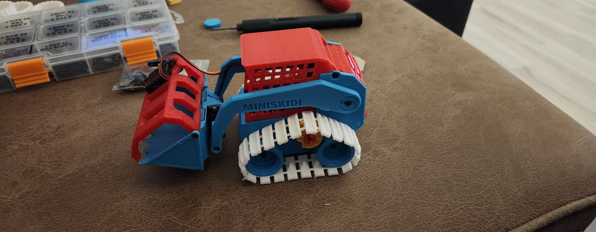
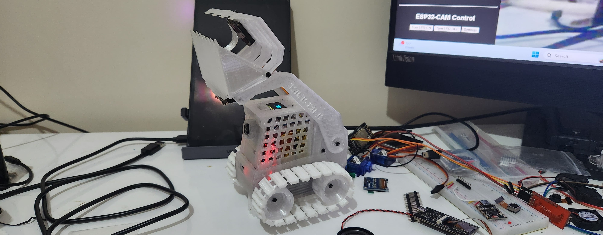
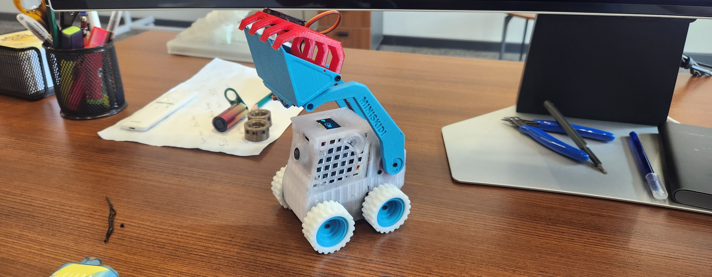
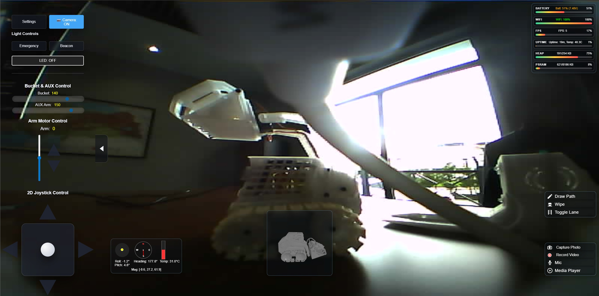
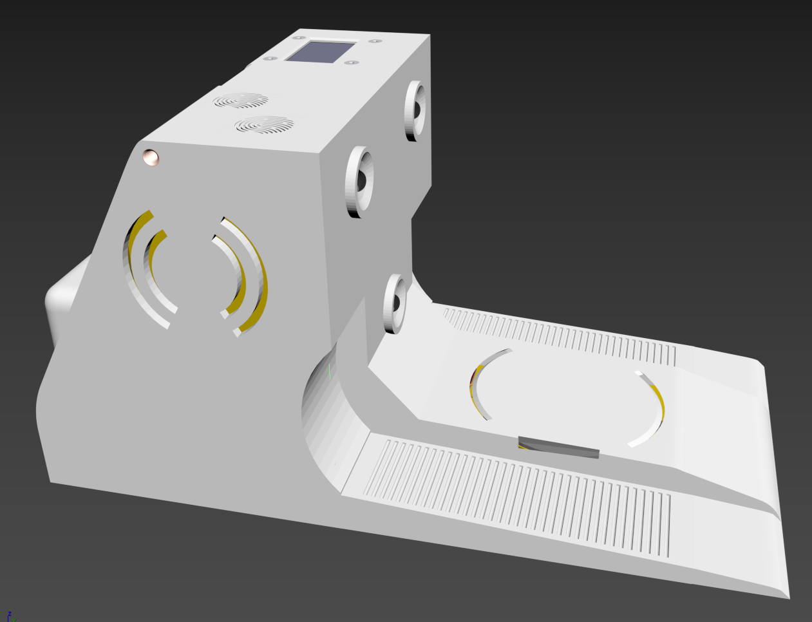
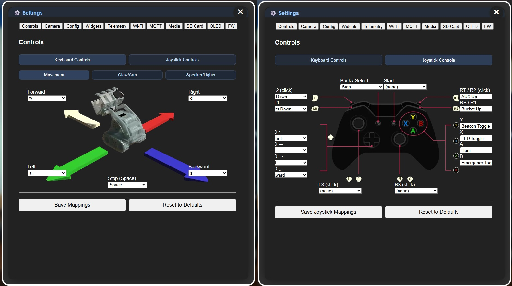
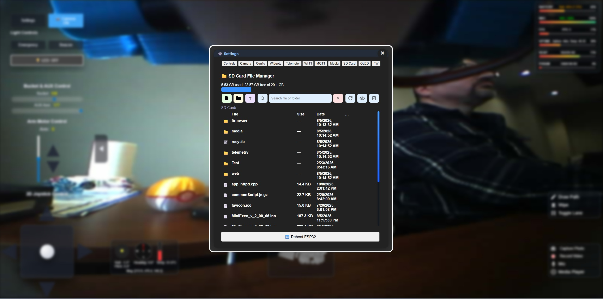

MiniExco Robot Firmware
=======================

Firmware for the MiniExco rover running on ESP32-S3-SPK v1.0 (8 MB PSRAM / 16 MB flash). It drives camera, audio, SD storage, LEDs, IMU, and web UI for autonomous robotics and media playback.









Project Lineage
---------------
MiniExco is a deep modification and extension of the MiniSkidi project:
- Original base project: https://github.com/ProfBoots/V2.0-3D-Printed-RC-SkidSteer

Cooling Requirement
-------------------
- The ESP32-S3 runs hot under Wi-Fi + camera + SD + audio load. Install **both** a metal heatsink on the ESP32-S3 and a low-profile 25 mm 5 V fan before long runs.
- There is no built-in thermal protection; overheating can cause resets or damage.

Stability Notes (Heap / Watchdog)
---------------------------------
- System stability is highly sensitive to heap (SRAM) pressure.
- If you customize features for personal use, continuously monitor heap load and keep it **below ~80%**.
- Above that range, instability risk rises sharply: typically Wi-Fi services degrade first, then under heavier load the ESP can stall/hang.
- To improve recovery behavior, enable watchdog auto-reset in:
  - **Left expandable menu -> Settings -> Config -> WS Disconnect Reboot Watchdog**
- Recommendation: keep this watchdog enabled for long unattended sessions.

microSD Reliability Notes
-------------------------
- Under long unattended runtime (continuous telemetry/media/video writes), low-end microSD cards may become unstable or fail.
- Typical failure signs:
  - card is still readable, but write operations fail intermittently
  - filesystem checks (`chkdsk`/fsck) hang or never complete
  - random missing/corrupted files after resets or power events
- Recommendation:
  - use **high-endurance** microSD cards only (for example: SanDisk Max Endurance / Samsung PRO Endurance)
  - buy from trusted sources to avoid counterfeit cards
  - avoid abrupt power loss while SD writes are active
  - replace cards at first sign of write instability

Hardware
--------
- ESP32-S3-SPK v1.0 with PSRAM
- Dual microphones + DAC to mono speaker
- OV2640 camera (MJPEG streaming, capture, video)
- microSD card for media and telemetry
- WS2812B LEDs
- Optional BNO055 IMU

Key Features
------------
- Web UI for driving, camera control, media playback, and settings
- MJPEG stream + snapshots; pause/resume streaming
- Telemetry: battery, charger, Wi-Fi, chip temp, FPS, IMU
- SD media playback and online radio
- Bluepad32 Bluetooth gamepad support (optional)
- Home Assistant discovery + MQTT telemetry (configurable)
- OTA updates (ElegantOTA)

Recent Changes (v2.01.01)
-------------------------
- Fixed arm motor power drop after servo usage by isolating servo timer configuration from arm motor PWM timing.
- Added servo auto-detach runtime handler in main loop (prevents servos staying attached indefinitely).
- Added servo/motor GPIO conflict guards to block unsafe mixed pin assignments.
- Improved arm jog controls in frontend:
  - jog command uses full-scale PWM (`255`)
  - reduced accidental release-to-zero behavior during press/hold interaction
- Frontend widget updates:
  - fixed scaled-widget drag anchor offset
  - fixed scaled-widget boundary placement consistency
  - smoothed widget scale transitions and post-scale settle behavior

Recent Additions (v2.1.01)
--------------------------
- Telemetry CSV logging reliability improvements:
  - fixed append/rotation edge cases that could leave newly rotated files with only a single data row
  - stronger append fallback and EOF seek handling to prevent accidental overwrite behavior
  - improved file-target selection and rotation flow to keep logging continuous
- SD Card File Manager recycle recovery fix:
  - added missing frontend recover handler (`sdRecover`) wired to `/recover_sd`
  - improved recover error surfacing and list refresh behavior
- SD Card File Manager search UX:
  - added toolbar search controls (search button + query input + clear button)
  - case-insensitive partial-name matching for files and folders
  - Enter-to-search and auto-reset to full list when query is cleared
  - search now loads full paged folder contents before filtering in large directories
- SD manager toolbar layout polish:
  - stabilized single-line control layout across root and subfolders
  - tightened spacing and responsive search sizing to avoid distortion

Recent Additions (v2.0.98)
--------------------------
- Widget system refactor and UX pass:
  - draggable widget frames with context actions
  - `gravityDrag` mode and plain `Drag` mode (no gravity settle)
  - default/delete/restore behavior integrated with View tab
- View tab improvements:
  - drag-to-add widget flow
  - miniature previews linked to live widgets
  - overlap/snap/gravity flags and gravity strength controls
  - improved scroll behavior and control layout polish
- Battery/heap/psram expandable telemetry panel improvements:
  - inline battery history graph flow hardened
  - expand/collapse edge handling near screen bottom
  - temporary lift/restore behavior for nearby widgets
- Frontend packaging cleanup:
  - extracted widget subsystem from `commonScript.js` into `web/widgetScript.js` for maintainability
- Memory optimizations and stability:
  - continued heap (SRAM) pressure reduction across UI/runtime paths
  - expanded PSRAM-first strategy for large/temporary data paths
  - net effect: major runtime stability improvements under sustained stream + telemetry + UI interaction load

Recent Additions (v2.0.94)
--------------------------
- Media list pagination hardened for very large libraries (thousands of files): index-first paging, early-stop scanning, `hasMore` response, and frontend request timeout/error recovery to prevent pending hangs.
- Camera streaming stability: start the port 81 server at boot even when the camera is disabled, larger HTTPD stack and socket/header limits, frame pacing (~25 fps cap) and merged MJPEG chunks to reduce Wi-Fi starvation, "Connection: close" and safer disconnect handling to avoid stuck pending streams.
- Camera sensor init is now lazy: the stream server starts at boot, but the sensor only inits when streaming/enabling; settings apply auto-resumes the stream to avoid 503 gaps.
- Web stack is split: a lightweight AP lobby starts first, with full routes/WebSocket attached on first page hit to keep boot heap higher.
- Dock UDP link (default port `5005`) with discovery, pairing, and on-demand telemetry:
  - Discovery (every ~5s until paired): rover broadcasts
    ```json
    { "type": "discover", "id": "MINIEXCO", "hw_id": "AA:BB:CC:DD:EE:FF" }
    ```
    Dock can listen for this to initiate pairing.
  - Dock sends:
    ```json
    { "type": "pair_request", "id": "<dock rover id>", "hw_id": "<rover MAC>", "dock_id": "MINIEXCODOCK", "dock_mac": "<dock MAC>" }
    ```
    Rover replies:
    ```json
    { "type": "pair_ack", "id": "<same rover id>", "hw_id": "<same rover MAC>", "accepted": true }
    ```
  - After paired, dock requests data:
    ```json
    { "type": "data_request", "id": "<paired rover id>", "hw_id": "<paired rover MAC>", "dock_id": "MINIEXCODOCK", "dock_mac": "<dock MAC>" }
    ```
    Rover replies with current telemetry (includes STA RSSI if available):
    ```json
    {
      "id": "MINIEXCO",
      "hw_id": "AA:BB:CC:DD:EE:FF",
      "battery_voltage": 7.52,
      "charger_voltage": 5.01,
      "charging_state": "YES",
      "battery_percent": 83,
      "rssi": -58
    }
    ```
- Telemetry/state cached from the normal battery/charger sampling loop (1 Hz).
  ```json
  {
    "id": "MINIEXCO",
    "hw_id": "AA:BB:CC:DD:EE:FF",
    "battery_voltage": 7.50,
    "charger_voltage": 5.05,
    "charging_state": "YES",
    "battery_percent": 83
  }
  ```
  `id` uses `S3_ID`; `hw_id` is the ESP32-S3 eFuse MAC (unique per board). Update `DOCK_UDP_PORT` in the sketch if your dock uses a different listener.

Serial Commands (v2.0.98)
-------------------------
- `help` — list all serial commands.
- `P<path>` — play WAV file from SD (e.g., `P /web/pcm/beep.wav`).
- `F|B|L|R<num>` — legacy motor control (Forward/Backward/Left/Right, with speed/value).
- `next`, `previous`, `play`, `stop`, `random`, `nextfolder` — track control.
- `+`, `-` — volume up/down; `list` — print current playlist.
- `heap` — system debug info; `wifi` — Wi-Fi debug info.
- `serverreboot` — restart web server stack.
- `reset`/`reboot` — reboot the ESP32.
- `dockadv on|off` or `adv on|off` — enable/disable dock discovery.
- `dockunpair` — clear saved dock pairing preferences.

Revision History (highlights)
-----------------------------
- v2.01.01: Arm/servo PWM interference fix, servo auto-detach loop handling, GPIO conflict guards, arm jog/full-power frontend tweak, and scaled-widget drag/settle fixes.
- v2.1.01: Telemetry CSV rotation/append fixes, SD recycle recover handler fix, SD file-manager search feature, and toolbar single-line layout stabilization.
- v2.0.98: Widget framework/refactor, gravity/drag modes, View tab controls and previews, expandable panel behavior fixes, memory stability improvements.
- v2.0.94: Media library listing stabilized for large SD collections; robust paging and UI timeout recovery.
- v2.0.90: Camera streaming hardened (HTTPD sizing, pacing, merged chunks, early server bring-up).
- v2.0.87: Added UDP dock heartbeat with battery/charging + hardware ID.
- v2.0.86: GPIOs configurable from config menu; web serial debug terminal.
- v2.0.85: Mobile browser support; axis swap for 3D model; tweaks/optimizations.
- v2.0.84: Reworked script/style loading; stream load at end; camera toggle resumes playback; fixed playlist/volume.
- v2.0.83: Reduced client disconnects.
- v2.0.82: Gzip index.html; 3D model display for tilt/pan.
- v2.0.81: Expandable interface; draw-path horizon flow.
- v2.0.80: Extended video feed.
- v2.0.78: Added 3D models; reworked Wi-Fi connection logic.
- v2.0.77: IP speak-up; AP/STA tuning; watchdog fixes.
- v2.0.76: Fixed NTP blocking; added IP speech; AP animation.
- v2.0.75: Wi-Fi priority across saved networks.
- v2.0.74..v2.0.56: Streaming, telemetry CSV, media library, MQTT/HA, PSRAM optimizations, camera controls (see history in git for details).

Build & Upload (Arduino / VS Code)
----------------------------------
1. Install ESP32 board support (esp32 2.0.14+).  
2. Board: ESP32-S3-SPK / ESP32-S3 with PSRAM enabled; flash 16 MB; partition `app3M_fat9M_16MB`; CPU 240 MHz.  
3. Open `MiniExco_v_2_01_01.ino`, set `port` in `.vscode/arduino.json`, click Verify/Upload.  
4. If upload stalls at “Connecting…”, hold BOOT (GPIO0) while clicking Upload; release when “Connecting…” appears.

Feature Switches (build-time)
-----------------------------
- `USE_BLUEPAD32`: 0=exclude BT gamepad, 1=include (default).
- `DEBUG_SERIAL`: 0=quiet, 1=verbose serial logging.
- `USE_PSRAM`: 1 to prefer PSRAM for large buffers (default).

TODO
----
- BMP180 barometric readings in UI
- Android APK + API
- Path-following algorithms
- Fix large file uploads
- OLED battery icon artifacts
- 3D model overlay follows IMU (tilt/turn + lights/animation)

References
----------
- MiniSkidi base project (original): https://github.com/ProfBoots/V2.0-3D-Printed-RC-SkidSteer
- Bluepad32 docs: https://bluepad32.readthedocs.io/en/latest/  
- Bluepad32 GitHub: https://github.com/ricardoquesada/bluepad32
- ESP32-S3-SPK v1.0 3D model: https://grabcad.com/library/esp32-spk-v1-0-1

Project Media (Placeholders)
----------------------------
- Rover 3D models: _placeholder (to be added)_
- Project overview: _placeholder (to be added)_
- YouTube video/demo: _placeholder (to be added)_
